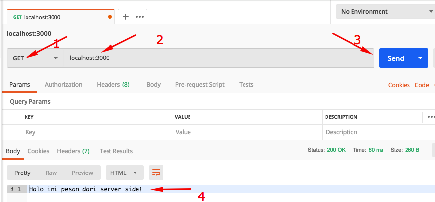
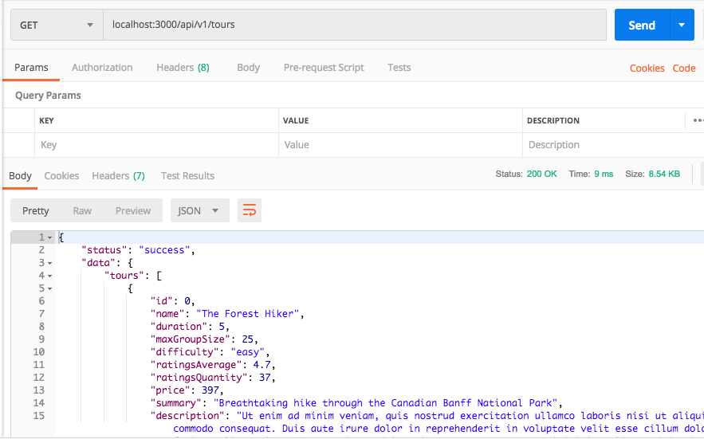
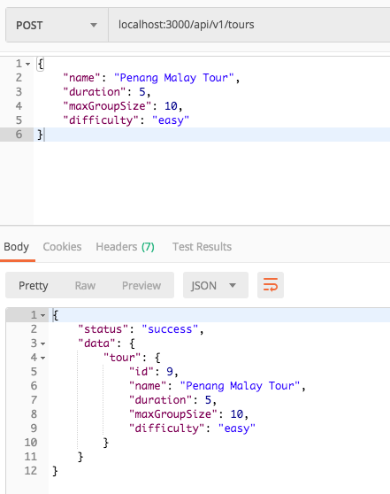
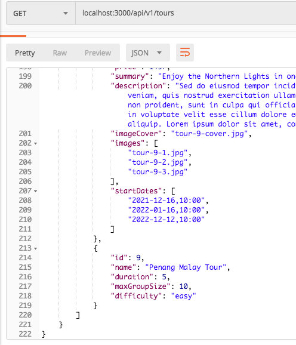
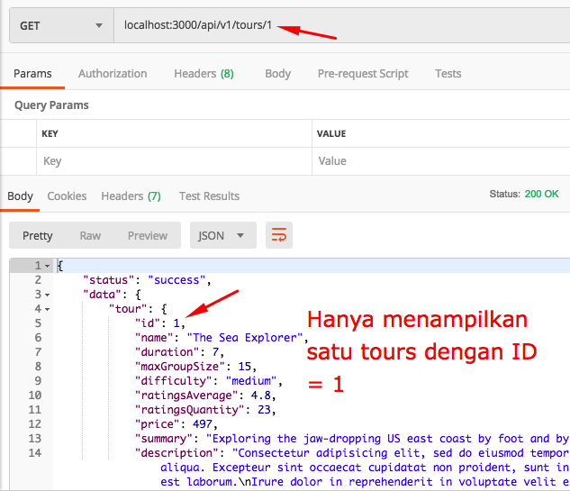

# Ben Tour

## Create Node Web / API Wisata & Travel


#### Persiapan

Setup Postman - https://www.postman.com/

Download project starter disini : https://drive.google.com/drive/folders/1qoj5g1ZJUb4OkL4Pej6UPey_uFm_dUJH?usp=sharing

Isi folder starter adalah sbb:

```
dev-data
public
.eslintrc.json
.gitignore
.prettierrc
```

Buka dengan VCS

Buka Integrated Terminal VCS

Lakukan Inital Project Node dengan perintah :

```
npm init
```

Isi semua pertanyaan dengan jawaban sbb:

```
package name : bentours (atau nama project aslinya dengan huruf kecil)
version : Enter saja
description : Enter saja
entry point : app.js
test command : Etner saja
git repo : Enter saja
keyword : Enter saja
author : JB Bumi

is this OK? (yes) Enter saja
```

Yang kamu isi diatas akan muncul di file package.json cekidot :

```
{
  "name": "bentours-app",
  "version": "1.0.0",
  "description": "bentour tour dan wisata webapp ",
  "main": "app.js",
  "scripts": {
    "test": "echo \"Error: no test specified\" && exit 1"
  },
  "repository": {
    "type": "git",
    "url": "git+https://github.com/vanbumi/bentours-app.git"
  },
  "author": "Bens",
  "license": "ISC",
  "bugs": {
    "url": "https://github.com/vanbumi/bentours-app/issues"
  },
  "homepage": "https://github.com/vanbumi/bentours-app#readme"
}
```


Perintah npm init akan membuat file baru yaitu "package.json" di folder project kamu, cekidot :

```
dev-data
public
.eslintrc.json
.gitignore
.prettierrc
package-lock.json <-------- baru!
package.json <-------- baru!
```

Install Express versi 4 ya!

```
npm i express@4
```

Cek di file package.json express sudah terinstal dengan versi 4.x.x

```
 ....
 ....
 
 "dependencies": {
    "express": "^4.17.1"
  }
}
```

Buat file baru di root "app.js" (satu level dengan package.json).

Update file app.js sbb :

```javascript
const express = require('express')

const app = express()

// Test route ke halaman index
app.get('/', (req, res) => {
    res.status(200).send('Halo ini pesan dari server side!')
})

// Aktifasi server node
const PORT = process.env.PORT || 3000
app.listen(PORT, () => {
    console.log(`Server berjalan di port ${PORT}...`)
})
```


Install nodemon, jika belum :

```
npm install nodemon -g
```


Jalankan server node pada Terminal dengan :

```
nodemon
```

hasilnya :

```
[nodemon] restarting due to changes...
[nodemon] restarting due to changes...
[nodemon] starting `node app.js`
Server berjalan di port 3000...
```

Buka browser localhost:3000, hasilnya tulisan :

```
Halo ini pesan dari server side!
```

Test dengan POSTMAN, buka postman dan tuliskan :

```
GET localhost:3000
```

Klik tombol Send

Hasilnya:

```
Halo ini pesan dari server side!
```




> Kesimpulan : Dengan demikian kita berhasil mengambil data dari server dengan Postman atau dari Browser dengan method GET.
>
> Demikian sebaliknya kita juga dapat mengirimkan data dari browser/postman ke server (database) dengan method POST.


#### JSON Format

Rubah response "send" dengan "json"

```
app.get('/', (req, res) => {
    res.status(200).json({message: 'Halo ini pesan dari server side!', app: 'bentours'})
})
```

Hasilnya akan menjadi format JSON :

```
{
    "message": "Halo ini pesan dari server side!",
    "app": "bentours"
}
```

selesai

Commit github : https://github.com/vanbumi/bentours-app/commit/c87beb32e3989177b4686ecb5f809def3f1a46a9


### Deploy to heroku.com

**Langkah Setup**

* Register di heroku.com : https://signup.heroku.com/

* Cek versi nodejs kamu,  versi nodejs harus > 10.0.0

  ```
  node --version
  ```

* Cek versi npm kamu :

  ```
  npm --version
  ```

* Cek apakah GIT sudah terinstal di komputer kamu?
```
git --version
```

* Buat file baru "Procfile" pada root level di nodejs app kamu dan isi dengan kode ini :

  ```
  web: npm start
  ```

* Pastikan pada file **package.json** kamu sudah tulis script  start : ```"start:node app.js"``` seperti dibawah ini:

  ```
  "scripts": {
      ....,
      "start": "node app.js"
    },
  ```

* Update Commit pada local komputer kamu dan push ke github

  ```
  git add .
  git commit -m "App siap deploy ke heroku.com"
  git push 
  ```

* Install heroku Command Line Interface (CLI) : https://devcenter.heroku.com/articles/getting-started-with-nodejs#set-up

* Setelah instalasi selesai buka Terminal dan jalankan perintah :

  ```
  heroku login
  ```

  browser akan muncul dan klik login button.

* Di Terminal lakukan perintah :

  ```
  heroku create
  ```

* Kemudian :

  ```
  git push heroku main
  ```

* Pastikan paling tidak ada satu instance dari app berjalan, dengan perintah :

  ```
  heroku ps:scale web=1
  ```

* Membuka app di browser dengan perintah :

  ```
  heroku open
  ```

* Ganti nama app :

  ```
  heroku rename bentours
  ```

* Bila ada error saat proses deploy lakukan logs untuk mendeteksi error :

  ```
  heroku logs --tail
  ```


Hasilnya bisa diklik disini : https://bentours.herokuapp.com/


### RESTful API


Update file app.js : Tambahkan kode dibawah :

```
const fs = require('fs')

const tours = JSON.parse(fs.readFileSync(`${__dirname}/dev-data/data/tours-simple.json`))

app.get('/api/v1/tours', (req, res) => {
    res.status(200).json({
        status: 'success',
        result: tours.length,
        data: {tours}
    })
})
```

Jalankan server :

```
nodemon app.js

// atau cukup dengan 

nodemon
```

Test GET request di POSTMAN :

```
GET localhost:3000/api/v1/tours
```

Hasilnya :



Test : 

* Di browser : localhost:3000/api/v1/tours dan 
* Di heroku : https://bentours.herokuapp.com/api/v1/tours

Commit Github : https://github.com/vanbumi/bentours-app/commits/main


### POST REQUEST


**Update File app.js**

Menambahkan middleware :

```
app.use(express.json())
```

Tambah request post dibawah request get sebelumnya 

```
app.post('/api/v1/tours', (req, res) => {
	console.log(req.body)
	res.send('Done')
})
```

Kemudia Test di POSTMAN

**Cara Menyimpan Request di POSTMAN**

/> Klik Collections 

/> Klik New Collections

/> Isi nama Collection : BenTours 

/> Klik Save button (ada di sebelah Send button).

/> Berinama (Request name) : Get All Tours

 /> Pilih Folder di bagian bawah : BenTours

Sekarang kita punya kumpulan request per project.


**Membuat Request POST**

Klik tanda + untuk membuat request baru di Tab yang baru.

GET POST localhost:3000/api/v1/tours

Simpan request post dengan perintah seperti diatas.

Berinama : Create New Tour

Save

Klik Tab Body

raw

JSON(application/json)

Tambahkan datanya dengan :

```
{
	"name": "Penang",
    "duration": 5,
    "maxGroupSize": 10,
    "difficulty": "easy",
}
```

Klik Send!

Bila berhasil tanpa error maka hasilnya pada Response kolom --> "Done" 

dan lihat di console Terminal. 


**Langkah berikutnya**

Mengganti console.log dengan request simpan agar bisa di simpan di data.

```javascript
app.post('/api/v1/tours', (req, res) => {
	
	// menambakan ID
  const newId = tours[tours.length -1].id + 1;
  const newTour = Object.assign({id: newId}, req.body);

  tours.push(newTour);
  
  fs.writeFile(
    `${__dirname}/dev-data/data/tours-simple.json`,
    JSON.stringify(tours),
    err => {
      res.status(201).json({
        status: 'success',
        data: {
          tour: newTour
        }
      })
    }
  )
}  
```

Test lagi di POSTMAN dengan data sebelumnya.



success 201

Bila kamu GET request lagi di Tab "Get All Tours" maka Tour diatas sudah ditambahkan di paling bawah :



Selesai

Commit Github : https://github.com/vanbumi/bentours-app/commit/9ae785454f03cb07e97ca6b09e36a82d62e82bdc

Heroku Live : https://bentours.herokuapp.com/api/v1/tours


### Single Request dengan ID


Melakukan GET Request berdasarkan ID Tour

```javascript
// GET REQUEST DENGAN ID
app.get('/api/v1/tours/:id', (req, res) => {

    // Merubah ID dari string ke number
    const id = req.params.id * 1

    // Bila ada request yang melebihi jumlah tours
    if (id > tours.length) {
        return res.status(404).json({
            status: 'fail',
            message: 'Invalid ID'
        })
    }

    // Query ke data collections
    const tour = tours.find(el => el.id === id)

    res.status(200).json({
        status: 'success',
        data: {
            tour
        }
    })
})
```

Test di POSTMAN

GET localhost:3000/api/v1/tours/1

Hasilnya : success 200



Selesai

Github Commit : https://github.com/vanbumi/bentours-app/commit/e4a476ca160252b7a9511db151f7b1e988c50ff9

Heroku Live : https://bentours.herokuapp.com/api/v1/tours/1


> **CATATAN** mulai sekarang bekerja development menggunakan git branch development, supaya branch main/master tetap aman dari error pada saat kita mengerjakan koding berikutnya dan berikutnya, dan jangan lupa untuk melakukan git commit setiap melewati tahapan pekerjaan, misalnya dari development satu ke development bagian yang lain.


Contoh :


3 Branch 

1. Branch dev : branch untuk melakukan development sehari-hari.
2. Branch main : branch Master, jika branch dev tidak ada bugs / error kemudian di merge ke branch main.
3. Branch  main_bkup: adalah branch Orisinal sebagai backup saja.


### Patch Request

Tambahkan kode request Patch di bawah request Post :

```javascript
// PATCH REQUEST
app.patch('/api/v1/tours/:id', (req, res) => {
  if (req.params.id * 1 > tours.length) {
    return res.status(404).json({
      status: 'fail',
      message: 'Invalid ID'
    })
  }

  res.status(200).json({
    status: 'success',
    data: {
      tour: '<Updated tour here....>'
    }
  })
})
```

Coba di POSTMAN


Percobaan diatas hanya meng-update "duration" menjadi 15. 

Commit github : https://github.com/vanbumi/bentours-app/commit/d9a065124a422be883d8fbaadb32d1e8180df910


### Delete Request


```javascript
// DELETE REQUEST
app.delete('/api/v1/tours/:id', (req, res) => {
  if (req.params.id * 1 > tours.length) {
    return res.status(404).json({
      status: 'fail',
      message: 'Invalid ID'
    })
  }

  res.status(204).json({
    status: 'success',
    data: null
  })
})
```

Test di POSTMAN


##### *) JANGAN LUPA SETIAP KALI TEST POSTMAN, SETIAP REQUEST MASING-MASING 1 TAB DAN SIMPAN UNTUK SUATU SAAT KITA INGIN TEST KEMBALI

CONTOH:


Github Repository : https://github.com/vanbumi/bentours-app

Commit Github : https://github.com/vanbumi/bentours-app/commit/6bccb699bfd174ac4173ae8b2368818b19eff73e


### Refactoring


Kita melakukan Refactor kode di file app.js menjadi seperti ini :

```javascript
const express = require('express')
const fs = require('fs')

const app = express()

// Add middleware
app.use(express.json())

app.get('/', (req, res) => {
    res.send('Welcome to Ben Tours!')
})

const tours = JSON.parse(fs.readFileSync(`${__dirname}/dev-data/data/tours-simple.json`))

const getAllTours = (req, res) => {
  res.status(200).json({
      status: 'success',
      result: tours.length,
      data: {tours}
  })
}

const getTour = (req, res) => {

  // Merubah ID dari string ke number
  const id = req.params.id * 1

  if (id > tours.length) {
      return res.status(404).json({
          status: 'fail',
          message: 'Invalid ID'
      })
  }

  // Query ke data collections
  const tour = tours.find(el => el.id === id)

  res.status(200).json({
      status: 'success',
      data: {
          tour
      }
  })
}

const createTour = (req, res) => {

  // menambakan ID
const newId = tours[tours.length -1].id + 1;
const newTour = Object.assign({id: newId}, req.body);

tours.push(newTour);

fs.writeFile(
  `${__dirname}/dev-data/data/tours-simple.json`,
  JSON.stringify(tours),
  err => {
    res.status(201).json({
      status: 'success',
      data: {
        tour: newTour
      }
    })
  }
)
}

const updateTour = (req, res) => {
  if (req.params.id * 1 > tours.length) {
    return res.status(404).json({
      status: 'fail',
      message: 'Invalid ID'
    })
  }

  res.status(200).json({
    status: 'success',
    data: {
      tour: '<Updated tour here....>'
    }
  })
}

const deleteTour = (req, res) => {
  if (req.params.id * 1 > tours.length) {
    return res.status(404).json({
      status: 'fail',
      message: 'Invalid ID'
    })
  }

  res.status(204).json({
    status: 'success',
    data: null
  })
}

// GET REQUREST (GET ALL TOURS)
//app.get('/api/v1/tours', getAllTours)
// GET REQUEST DENGAN ID
//app.get('/api/v1/tours/:id', getTour)
// POST REQUEST
//app.post('/api/v1/tours', createTour)
// PATCH REQUEST
//app.patch('/api/v1/tours/:id', updateTour)
// DELETE REQUEST
//app.delete('/api/v1/tours/:id', deleteTour)

// SEMUA DI ATAS BISA DI REFACTOR SEPERTI DIBAWAH INI
app
  .route('/api/v1/tours')
  .get(getAllTours)
  .post(createTour)

app.route('/api/v1/tours/:id')
  .get(getTour)
  .patch(updateTour)
  .delete(deleteTour)


// SETUP SERVER
const PORT = process.env.PORT || 3000
app.listen(PORT, () => {
    console.log(`Server berjalan di port ${PORT}...`)
})
```

Kamu bisa liat semua Refactor kode di Commit Repository nya disini : https://github.com/vanbumi/bentours-app/commit/f464e656a7484b64ed33630be2ac242e3b1d6b94

Selesai bab Refactor, lanjut ke bab berikutnya.


### Users Routes

Kita ulangi lagi membuat Routes tapi untu Users, sbb :

```javascript
// Users Routes
app
  .route('/api/v1/users')
  .get(getAllUsers)
  .post(createUser)
  
app
  .route('/api/v1/users/:id')
  .get(getUser)
  .patch(updateUser)
  .delete(deleteUser)
```

Dan Kemudian juga membuat Request nya sbb :

```javascript
// Users Request
const getAllUsers = (req, res) => {
  res.status(500).json({
    status: 'error',
    message: 'This route is not defined yet!'
  })
}

const getUser = (req, res) => {
  res.status(500).json({
    status: 'error',
    message: 'This route is not defined yet!'
  })
}

const createUser = (req, res) => {
  res.status(500).json({
    status: 'error',
    message: 'This route is not defined yet!'
  })
}

const updateUser = (req, res) => {
  res.status(500).json({
    status: 'error',
    message: 'This route is not defined yet!'
  })
}

const deleteUser = (req, res) => {
  res.status(500).json({
    status: 'error',
    message: 'This route is not defined yet!'
  })
}
```

Request user diatas response nya belum kita define kita buat dulu seperti message diatas untuk di test di POSTMAN.

```
res.status(500).json({
  status: 'error',
  message: 'This route is not defined yet!'
})
```

Test di POSMANT


Oya jangan lupa install morgan :

```
npm install morgan
```

morgan adalah **Middleware** HTTP request logger untuk Node.js. Gunanya untuk menyederhanakan process of logging requests di aplikasi kamu langsung di Terminal console. Contoh:


Lanjut ke bab berikutnya

Bentour Repo: https://github.com/vanbumi/bentours-app

Github Commit : https://github.com/vanbumi/bentours-app/commit/d9a065124a422be883d8fbaadb32d1e8180df910


### Mounting Multiple Routers

Kita akan sederhanakan lagi kode nya dengan menggunakan Routers, menjadi seperti ini:

```javascript
// Menggunakan Middleware Router
const tourRouter = express.Router()
const userRouter = express.Router()

tourRouter
  .route('/')
  .get(getAllTours)
  .post(createTour)

tourRouter
  .route('/:id')
  .get(getTour)
  .patch(updateTour)
  .delete(deleteTour)

// Users Routes
userRouter
  .route('/')
  .get(getAllUsers)
  .post(createUser)
  
userRouter
  .route('/:id')
  .get(getUser)
  .patch(updateUser)
  .delete(deleteUser)

// Tempatkan middleware dibawah agar terekskusi setelah Router di deklarasikan.
app.use('/api/v1/tours', tourRouter)
app.use('/api/v1/users', userRouter)
```

Jangan lupa test di POSTMAN, untuk memastikan tidak ada error.

Commit github : https://github.com/vanbumi/bentours-app/commit/30b64ad380260a6b47601582f0d03bfb0adb54c9

next vid 17. A Better File Structure

