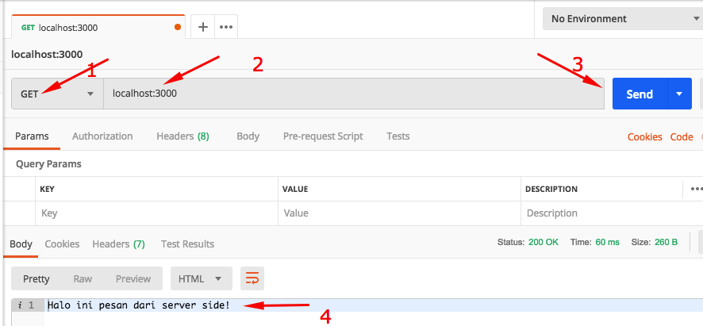
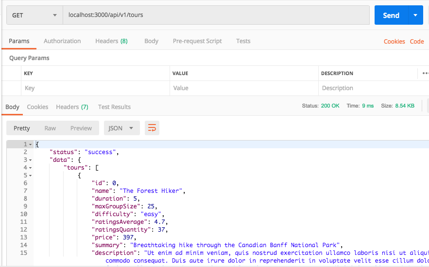
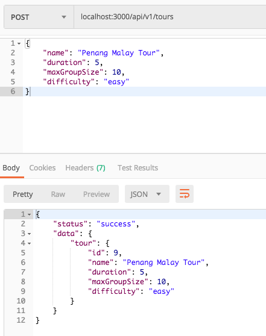
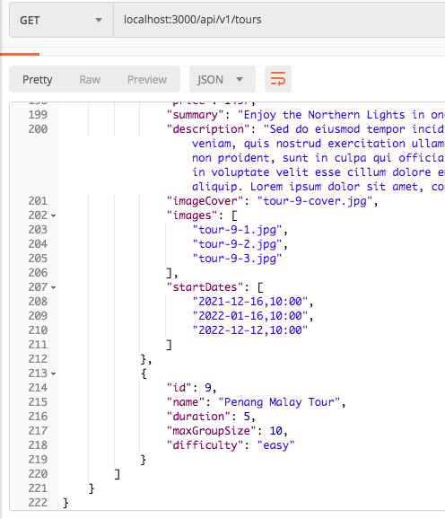
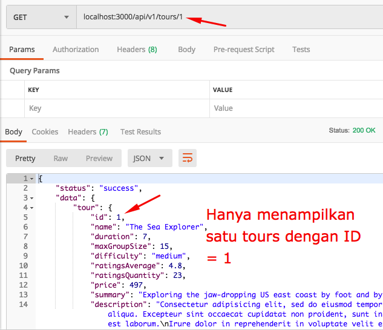

# Ben Tour

## Create Node Web / API Wisata & Travel


#### Persiapan

Setup Express JS - https://expressjs.com/

Setup Postman - https://www.postman.com/


#### Setup ExpressJS

Download project starter disini : https://drive.google.com/drive/folders/1qoj5g1ZJUb4OkL4Pej6UPey_uFm_dUJH?usp=sharing

Isi folder starter adalah sbb:

```
dev-data
public
.eslintrc.json
.gitignore
.prettierrc
```

Buka dengan VCS

Buka Integrated Terminal VCS

Lakukan Inital Project Node dengan perintah :

```
npm init
```

Isi semua pertanyaan dengan jawaban sbb:

```
package name : bentours (atau nama project aslinya dengan huruf kecil)
version : Enter saja
description : Enter saja
entry point : app.js
test command : Etner saja
git repo : Enter saja
keyword : Enter saja
author : JB Bumi

is this OK? (yes) Enter saja
```

Yang kamu isi diatas akan muncul di file package.json cekidot :

```
{
  "name": "bentours-app",
  "version": "1.0.0",
  "description": "bentour tour dan wisata webapp ",
  "main": "app.js",
  "scripts": {
    "test": "echo \"Error: no test specified\" && exit 1"
  },
  "repository": {
    "type": "git",
    "url": "git+https://github.com/vanbumi/bentours-app.git"
  },
  "author": "Bens",
  "license": "ISC",
  "bugs": {
    "url": "https://github.com/vanbumi/bentours-app/issues"
  },
  "homepage": "https://github.com/vanbumi/bentours-app#readme"
}
```


Perintah npm init akan membuat file baru yaitu "package.json" di folder project kamu, cekidot :

```
dev-data
public
.eslintrc.json
.gitignore
.prettierrc
package-lock.json <-------- baru!
package.json <-------- baru!
```

Install Express versi 4 ya!

```
npm i express@4
```

Cek di file package.json express sudah terinstal dengan versi 4.x.x

```
 ....
 ....
 
 "dependencies": {
    "express": "^4.17.1"
  }
}
```

Buat file baru di root "app.js" (satu level dengan package.json).

Update file app.js sbb :

```javascript
const express = require('express')

const app = express()

// Test route ke halaman index
app.get('/', (req, res) => {
    res.status(200).send('Halo ini pesan dari server side!')
})

// Aktifasi server node
const PORT = process.env.PORT || 3000
app.listen(PORT, () => {
    console.log(`Server berjalan di port ${PORT}...`)
})
```


Install nodemon, jika belum :

```
npm install nodemon -g
```


Jalankan server node pada Terminal dengan :

```
nodemon
```

hasilnya :

```
[nodemon] restarting due to changes...
[nodemon] restarting due to changes...
[nodemon] starting `node app.js`
Server berjalan di port 3000...
```

Buka browser localhost:3000, hasilnya tulisan :

```
Halo ini pesan dari server side!
```

Test dengan POSTMAN, buka postman dan tuliskan :

```
GET localhost:3000
```

Klik tombol Send

Hasilnya:

```
Halo ini pesan dari server side!
```




> Kesimpulan : Dengan demikian kita berhasil mengambil data dari server dengan Postman atau dari Browser dengan method GET.
>
> Demikian sebaliknya kita juga dapat mengirimkan data dari browser/postman ke server (database) dengan method POST.


#### JSON Format

Rubah response "send" dengan "json"

```
app.get('/', (req, res) => {
    res.status(200).json({message: 'Halo ini pesan dari server side!', app: 'bentours'})
})
```

Hasilnya akan menjadi format JSON :

```
{
    "message": "Halo ini pesan dari server side!",
    "app": "bentours"
}
```

selesai

Commit github : https://github.com/vanbumi/bentours-app/commit/c87beb32e3989177b4686ecb5f809def3f1a46a9


### Deploy to heroku.com

**Langkah Setup**

* Register di heroku.com : https://signup.heroku.com/

* Cek versi nodejs kamu,  versi nodejs harus > 10.0.0

  ```
  node --version
  ```

* Cek versi npm kamu :

  ```
  npm --version
  ```

* Cek apakah GIT sudah terinstal di komputer kamu?
```
git --version
```

* Buat file baru "Procfile" pada root level di nodejs app kamu dan isi dengan kode ini :

  ```
  web: npm start
  ```

* Pastikan pada file **package.json** kamu sudah tulis script  start : ```"start:node app.js"``` seperti dibawah ini:

  ```
  "scripts": {
      ....,
      "start": "node app.js"
    },
  ```

* Update Commit pada local komputer kamu dan push ke github

  ```
  git add .
  git commit -m "App siap deploy ke heroku.com"
  git push 
  ```

* Install heroku Command Line Interface (CLI) : https://devcenter.heroku.com/articles/getting-started-with-nodejs#set-up

* Setelah instalasi selesai buka Terminal dan jalankan perintah :

  ```
  heroku login
  ```

  browser akan muncul dan klik login button.

* Di Terminal lakukan perintah :

  ```
  heroku create
  ```

* Kemudian :

  ```
  git push heroku main
  ```

* Pastikan paling tidak ada satu instance dari app berjalan, dengan perintah :

  ```
  heroku ps:scale web=1
  ```

* Membuka app di browser dengan perintah :

  ```
  heroku open
  ```

* Ganti nama app :

  ```
  heroku rename bentours
  ```

* Bila ada error saat proses deploy lakukan logs untuk mendeteksi error :

  ```
  heroku logs --tail
  ```


Hasilnya bisa diklik disini : https://bentours.herokuapp.com/


### RESTful API


Update file app.js : Tambahkan kode dibawah :

```
const fs = require('fs')

const tours = JSON.parse(fs.readFileSync(`${__dirname}/dev-data/data/tours-simple.json`))

app.get('/api/v1/tours', (req, res) => {
    res.status(200).json({
        status: 'success',
        result: tours.length,
        data: {tours}
    })
})
```

Jalankan server :

```
nodemon app.js

// atau cukup dengan 

nodemon
```

Test GET request di POSTMAN :

```
GET localhost:3000/api/v1/tours
```

Hasilnya :



Test : 

* Di browser : localhost:3000/api/v1/tours dan 
* Di heroku : https://bentours.herokuapp.com/api/v1/tours

Commit Github : https://github.com/vanbumi/bentours-app/commits/main


### POST REQUEST


**Update File app.js**

Menambahkan middleware :

```
app.use(express.json())
```

Tambah request post dibawah request get sebelumnya 

```
app.post('/api/v1/tours', (req, res) => {
	console.log(req.body)
	res.send('Done')
})
```

Kemudia Test di POSTMAN

**Cara Menyimpan Request di POSTMAN**

/> Klik Collections 

/> Klik New Collections

/> Isi nama Collection : BenTours 

/> Klik Save button (ada di sebelah Send button).

/> Berinama (Request name) : Get All Tours

 /> Pilih Folder di bagian bawah : BenTours

Sekarang kita punya kumpulan request per project.


**Membuat Request POST**

Klik tanda + untuk membuat request baru di Tab yang baru.

GET POST localhost:3000/api/v1/tours

Simpan request post dengan perintah seperti diatas.

Berinama : Create New Tour

Save

Klik Tab Body

raw

JSON(application/json)

Tambahkan datanya dengan :

```
{
	"name": "Penang",
    "duration": 5,
    "maxGroupSize": 10,
    "difficulty": "easy",
}
```

Klik Send!

Bila berhasil tanpa error maka hasilnya pada Response kolom --> "Done" 

dan lihat di console Terminal. 


**Langkah berikutnya**

Mengganti console.log dengan request simpan agar bisa di simpan di data.

```javascript
app.post('/api/v1/tours', (req, res) => {
	
	// menambakan ID
  const newId = tours[tours.length -1].id + 1;
  const newTour = Object.assign({id: newId}, req.body);

  tours.push(newTour);
  
  fs.writeFile(
    `${__dirname}/dev-data/data/tours-simple.json`,
    JSON.stringify(tours),
    err => {
      res.status(201).json({
        status: 'success',
        data: {
          tour: newTour
        }
      })
    }
  )
}  
```

Test lagi di POSTMAN dengan data sebelumnya.



success 201

Bila kamu GET request lagi di Tab "Get All Tours" maka Tour diatas sudah ditambahkan di paling bawah :



Selesai

Commit Github : https://github.com/vanbumi/bentours-app/commit/9ae785454f03cb07e97ca6b09e36a82d62e82bdc

Heroku Live : https://bentours.herokuapp.com/api/v1/tours


### Single Request dengan ID


Melakukan GET Request berdasarkan ID Tour

```javascript
// GET REQUEST DENGAN ID
app.get('/api/v1/tours/:id', (req, res) => {

    // Merubah ID dari string ke number
    const id = req.params.id * 1

    // Bila ada request yang melebihi jumlah tours
    if (id > tours.length) {
        return res.status(404).json({
            status: 'fail',
            message: 'Invalid ID'
        })
    }

    // Query ke data collections
    const tour = tours.find(el => el.id === id)

    res.status(200).json({
        status: 'success',
        data: {
            tour
        }
    })
})
```

Test di POSTMAN

GET localhost:3000/api/v1/tours/1

Hasilnya : success 200



Selesai

Github Commit : https://github.com/vanbumi/bentours-app/commit/e4a476ca160252b7a9511db151f7b1e988c50ff9

Heroku Live : https://bentours.herokuapp.com/api/v1/tours/1